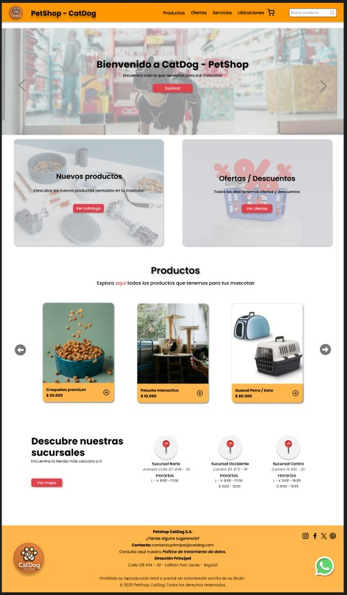

# 🐶🐱 PetShop CatDog - Página de Inicio

Bienvenido al proyecto **PetShop CatDog**, una landing page responsiva construida con **HTML**, **CSS** y **Bootstrap 5**. Este sitio está orientado a una tienda para mascotas con secciones como productos, ubicaciones, contacto y promociones.

---

## 🚀 Funcionalidades principales

- ✅ Menú de navegación responsive con enlaces anclados.
- ✅ Carrusel animado de banners promocionales.
- ✅ Secciones de tarjetas para productos destacados y ofertas.
- ✅ Mapa de ubicaciones físicas.
- ✅ Footer informativo con redes sociales.
- ✅ Botón flotante de **WhatsApp** para contacto directo.
- ✅ Formulario de contacto funcional con alerta personalizada.

---

## 🎨 Personalizaciones aplicadas

### 🔘 Botón flotante de WhatsApp

- Posicionado en la parte inferior derecha.
- Redirige a `https://wa.me` con número en formato internacional.
- Incluye icono personalizado y efecto `hover`.

### 📱 Responsive para productos en móviles

- A partir de **576px o más**:
  - Las tarjetas de productos se muestran **una por una** (scroll horizontal).
  - Los botones de navegación `anterior/siguiente` se posicionan en la **parte superior** y se achican visualmente.

### 🚧 Alerta visual para módulos en construcción

- Al hacer clic en **"Ofertas"** o **"Servicios"** desde el navbar, aparece una alerta Bootstrap con el mensaje:
  > *"Ooops! Este módulo se encuentra en construcción..."*
- La alerta:
  - Se muestra de forma **flotante en la esquina inferior derecha** (o superior centrada si se desea).
  - Desaparece automáticamente tras 5 segundos.
  - Incluye icono de herramientas (`bi-tools`) y botón para cerrarla manualmente.

### 📨 Alerta visual al enviar el formulario de contacto

- Al enviar el formulario:
  - Se muestra una **alerta centrada en la parte superior** de la pantalla.
  - Contiene un mensaje personalizado con el nombre y mensaje del usuario.
  - Se oculta automáticamente tras 5 segundos.
  - Sustituye al antiguo `alert()` nativo de JavaScript.
  
---

## 📌 Tecnologías utilizadas

- **HTML5**
- **CSS3**
- **Bootstrap 5.3.5**
- **JavaScript**

---

## 🎨 Diseño en Figma + Vista previa

Este proyecto fue diseñado previamente en Figma como guía visual para su estructura y estilo.

- 🔗 [Ver diseño en Figma](https://www.figma.com/design/phv1oIggQi2kh9tpQJFRbM/Landingpage-PetShop?node-id=0-1&t=77u1tyW7SXDbxokC-1)

### 📸 Captura de pantalla

---

## 👤 German Bermudez Buitrago

**PetShop CatDog**  
Sitio desarrollado como parte de un proyecto web para comercio de productos de mascotas.  
Inspirado en prácticas modernas de desarrollo frontend.

---
© 2025 PetShop CatDog. Todos los derechos reservados.